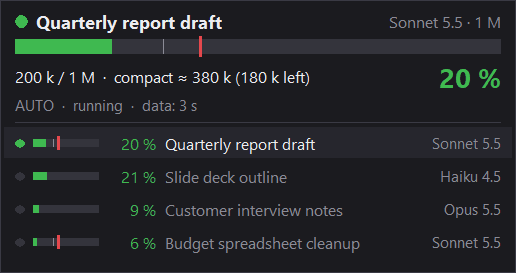

# Cowork Context HUD

**Voyez le contexte de Cowork se remplir avant la compaction.**

[English](README.md)

*Capture sous Windows, avec des données de démonstration inventées (titres de conversations fictifs).*

La compaction automatique m'a coupé en plein travail plus de fois que je ne saurais le dire. À ma connaissance, Cowork n'indique pas à quel point une conversation est remplie, donc on s'en rend compte une fois que c'est déjà arrivé. Je voulais un chiffre que je puisse regarder d'un coup d'œil, alors j'ai écrit ça : une petite fenêtre qui reste au premier plan et affiche le contexte de votre conversation Cowork active, avec un repère rouge à l'endroit où la compaction s'est déjà déclenchée chez vous, et une alerte quand vous vous en approchez.

C'est un seul fichier Python, sans dépendance hors de la bibliothèque standard, qui lit le cache local de Claude Desktop sans jamais y écrire. La demande d'Anthropic pour un indicateur intégré, l'[issue #37568](https://github.com/anthropics/claude-code/issues/37568), a été fermée comme non prévue par le robot d'inactivité, puis verrouillée.

## Installation

Il faut Python 3.8 ou plus récent, avec tkinter. L'installeur de python.org pour Windows l'inclut.

**Windows** (la plateforme que j'utilise et que j'ai testée)

1. Récupérez le code : `git clone https://github.com/Kayhalan/cowork-context-hud.git`, puis `cd cowork-context-hud`. Vous pouvez aussi télécharger `context_hud.py` seul, c'est tout le programme.
2. Ouvrez quelques conversations Cowork dans Claude Desktop. Le HUD ne peut afficher une conversation qu'après que Claude Desktop l'a mise en cache.
3. Lancez-le sans fenêtre de console. Dans PowerShell :

        Start-Process pythonw.exe -ArgumentList "context_hud.py" -WindowStyle Hidden

   Dans cmd :

        start /b pythonw "context_hud.py"

   Pour voir les messages dans le terminal à la place, lancez `python context_hud.py`.
4. Pour l'arrêter, clic droit dessus puis « Quitter ».

**macOS** (expérimental, personne ne l'a encore lancé sur un Mac)

1. Vérifiez que tkinter est présent : `python3 -c "import tkinter; print(tkinter.TkVersion)"`.
2. Clonez le dépôt comme ci-dessus et lancez `python3 context_hud.py` depuis son dossier.
3. Que ça marche ou non, dites-le-moi. [TESTS_MACOS.md](TESTS_MACOS.md) (en anglais) liste ce qu'il faut vérifier et ce qu'il faut renvoyer. Si la fenêtre sans bordure se comporte mal, essayez `python3 context_hud.py --framed`.

Linux n'est pas pris en charge. Si vous voulez essayer quand même, `--data-dir` permet de désigner un dossier de données de Claude Desktop.

## Utilisation

| Action | Windows | macOS |
|---|---|---|
| Déplacer | Glisser | Glisser |
| Afficher ou masquer toutes les conversations | Double-clic | Double-clic |
| Épingler une conversation (liste affichée) | Clic sur sa ligne | Clic sur sa ligne |
| Taille | Ctrl + molette | Ctrl + molette |
| Opacité | Maj + molette | Maj + molette |
| Largeur | Alt + molette | Option + molette |
| Menu | Clic droit | Clic droit ou Ctrl + clic |

Le menu propose aussi le niveau d'alerte (60, 70, 80 ou 90 % du seuil de compactage), le son d'alerte, le premier plan, la langue (anglais ou français) et une remise à zéro de l'apparence. Les réglages sont mémorisés.

Par défaut, le HUD suit la conversation en cours d'exécution, sinon la plus récente. Épinglez-en une pour la garder à l'écran.

Options de la ligne de commande :

| Option | Effet |
|---|---|
| `--once` | Affiche un tableau dans le terminal puis quitte |
| `--debug` | Le tableau, plus les fichiers lus et le temps de chacun |
| `--lang en` ou `--lang fr` | Langue de l'interface pour ce lancement. C'est le choix du menu qui est mémorisé |
| `--data-dir CHEMIN` | Lit ce dossier de données de Claude Desktop au lieu de le chercher |
| `--warn N` | Alerte à N % du seuil de compactage (80 par défaut, ou la dernière valeur choisie) |
| `--compact-at TOKENS` | Fixe le seuil de compactage à la main |
| `--window TOKENS` | Force la taille de la fenêtre |
| `--interval SECONDES`, `--days N`, `--limit N` | Fréquence de lecture, âge maximal d'une conversation, nombre de conversations listées |
| `--alpha`, `--zoom`, `--width` | Opacité, taille et largeur au démarrage |
| `--framed` | Fenêtre normale avec barre de titre |
| `--version` | Affiche la version |

## Vie privée

Je poserais la même question, alors la réponse vient en premier.

Le stockage local de Claude Desktop contient le texte de vos conversations. Ce programme ouvre ces fichiers et les décode en mémoire, donc oui, il passe sur ce contenu. Il en garde les nombres de tokens, le modèle, la taille de la fenêtre de contexte, les événements de compaction, les titres et identifiants des conversations, quelques horodatages et les jauges de quota. Il ne garde pas les messages. Rien de ces fichiers n'est écrit sur le disque, copié ou envoyé quelque part.

Il n'y a aucun code réseau. Inutile de me croire sur parole : le programme tient dans un seul fichier, et ses imports sont en haut. Ce sont la bibliothèque standard de Python (`argparse`, `json`, `os`, `pathlib`, `re`, `struct`, `sys`, `threading`, `time`, `traceback`, `tkinter`) et, selon la plateforme, `ctypes`, `winsound`, `msvcrt` ou `fcntl`. Pas de `socket`, pas de `urllib`, pas de `http`.

Il ne fait que lire le dossier de Claude Desktop. Tout ce qu'il écrit se trouve à côté du script : `context_hud_state.json` (position de la fenêtre, réglages, langue, seuils de compactage et tailles de fenêtre appris, identifiant de la conversation épinglée), `context_hud.lock` (pour empêcher un second HUD) et `context_hud.log`, qui n'est écrit que lorsqu'une erreur survient. Tous figurent dans `.gitignore`.

Quand vous collez une sortie quelque part, souvenez-vous que `--once`, `--debug` et le journal peuvent afficher des titres de conversations et des chemins de dossiers, qui contiennent votre nom d'utilisateur. Masquez-les avant de coller quoi que ce soit dans une issue.

Un détail de plus : pour lire le quota, le programme décode toutes les entrées de la base Local Storage de Claude Desktop et ne garde que celles du quota. Je ne sais pas ce qu'elle contient d'autre, et le reste est jeté de la mémoire aussitôt.

## Comment ça marche

Claude Desktop garde un cache local de l'interface Cowork (l'IndexedDB et le Local Storage de son application Electron). Quand vous ouvrez une conversation ou qu'un tour se termine, l'application y écrit la conversation. Le HUD retrouve ces fichiers et les décode avec ses propres petits décodeurs pour Snappy, le format de sérialisation V8 et LevelDB, tous dans le même fichier. Pour chaque conversation, il prend le dernier tour du fil principal et additionne les tokens d'entrée, de création de cache, de lecture de cache et de sortie. Les tours des sous-agents sont ignorés.

Ce total est comparé à la fenêtre de contexte du modèle. La fenêtre vient de la valeur `contextWindow` que Cowork indique, et quand elle n'y est pas encore, d'une petite table dans le code (200 000 pour Haiku, 1 000 000 pour les modèles Sonnet et Opus récents, 200 000 pour tout modèle inconnu).

Le repère rouge marque le début de la compaction. Le cache enregistre chaque compaction avec le nombre de tokens auquel elle a eu lieu. Le HUD garde la plus basse des compactions automatiques pour chaque modèle, l'enregistre dans le fichier d'état et dessine le repère à cet endroit. Dans mes propres données, elle s'est déclenchée vers 382 000 tokens sur Sonnet 5.5, avec une fenêtre de 1 000 000, soit environ 38 %. Chez vous, ce sera peut-être différent, et cela peut changer avec les mises à jour de Claude Desktop. Si une conversation du même modèle dépasse de plus de 2 % le seuil enregistré sans être compactée, le HUD cesse de lui faire confiance.

L'alerte se mesure à partir de ce repère. Par défaut à 80 % de celui-ci, le cadre clignote en rouge quelques secondes et vous entendez un bip (le son d'exclamation de Windows sous Windows, la cloche de Tk ailleurs). Elle se déclenche une fois par conversation et se réarme quand la conversation redescend de 10 points sous le niveau d'alerte. Si une conversation dépasse déjà le niveau au démarrage du HUD, l'alerte se déclenche tout de suite.

Les jauges de quota (la session de 5 heures et la semaine) utilisent la plus récente de trois sources locales, et le HUD indique l'âge de chaque mesure.

## Limites

- Le cache n'est pas documenté par Anthropic comme source de données. Ça fonctionne aujourd'hui sur ma machine, et une mise à jour de Claude Desktop peut le casser sans prévenir. Si ça arrive, `--debug` montre ce qui a été lu.
- Claude Desktop écrit le cache quand il charge une conversation, donc les chiffres peuvent avoir un peu de retard. Le HUD affiche l'âge des données. Une conversation que vous n'avez jamais ouverte n'a pas encore de données, et le HUD le dit.
- Il n'y a pas de repère rouge tant que le HUD n'a pas vu une compaction automatique de ce modèle sur votre machine. D'ici là, l'alerte se calcule sur toute la fenêtre. `--compact-at` permet de le fixer à la main.
- Un modèle absent de la table reçoit une fenêtre de 200 000 tokens jusqu'à ce que Cowork indique la vraie, donc le pourcentage peut être faux pendant un moment. La table demande de l'entretien.
- Il lit le dossier standard de Claude Desktop, y compris le paquet Microsoft Store sous Windows. Le dossier séparé du mode plateforme tierce (`Claude-3p`) n'est pas lu.
- Seules les conversations Cowork sont couvertes.
- Testé par moi sous Windows, avec Claude Desktop 2.19675.0 et Python 3.12. Personne n'a testé macOS. Je ne sais pas encore si le cache a la même structure là-bas.

## Alternatives

Je ne suis pas le premier à vouloir ça. D'autres outils existent, que j'ai trouvés en vérifiant. Je ne prétends pas que la liste soit complète ni à jour, et ils lisent d'autres sources que celui-ci : [cowork-context-meter](https://github.com/a-data3/cowork-context-meter) de a-data3, [claude-context-meter](https://github.com/nowoandi/claude-context-meter) de nowoandi, [Context-Canary](https://github.com/amarisaster/Context-Canary) de amarisaster, et [usage-monitor-for-claude](https://github.com/jens-duttke/usage-monitor-for-claude) de jens-duttke, qui ne couvre que les quotas. Essayez-les et gardez ce qui vous convient.

## Avertissement

C'est un projet communautaire. Il n'est pas officiel, et il n'est ni affilié à Anthropic, ni approuvé, ni soutenu par Anthropic. Claude et Cowork sont des noms d'Anthropic. Je décris seulement ce que fait le programme : il lit des fichiers sur votre propre ordinateur et ne parle à personne. Si les conditions d'Anthropic comptent pour vous, lisez-les vous-même.

## Licence

Le code est disponible en source sous la [licence PolyForm Noncommercial 1.0.0](LICENSE). Ce n'est pas de l'open source au sens de l'OSI. L'usage non commercial est libre : usage personnel, et usage par les associations caritatives, les écoles, les organismes publics de recherche, les organisations de sécurité ou de santé publique, les organisations de protection de l'environnement et les administrations, comme le texte de la licence les énumère.

Pour un usage commercial, il faut une licence commerciale auprès de moi. Ouvrez une issue intitulée « Commercial license » en disant que vous aimeriez en parler. N'y mettez pas de coordonnées personnelles, je vous indiquerai comment continuer. Si vous n'êtes pas sûr que votre usage soit non commercial, demandez avant de vous fier à ma lecture. Je ne suis pas juriste, et c'est le texte de la licence qui fait foi.

## Contribuer

Les contributions de code sont les bienvenues, selon les termes de [CLA.md](CLA.md), résumés dans [CONTRIBUTING.md](CONTRIBUTING.md) (en anglais). Le plus utile pour l'instant est un retour de test : la version du système, la version de Claude Desktop, et ce qui a marché. Pour macOS, [TESTS_MACOS.md](TESTS_MACOS.md) est la liste.

## À propos

Je suis Kayhalan, développeur full-stack en France, et c'est moi qui ai écrit ceci. Le portage macOS, les textes anglais et les fichiers autour du code ont été préparés avec l'aide de Claude.
